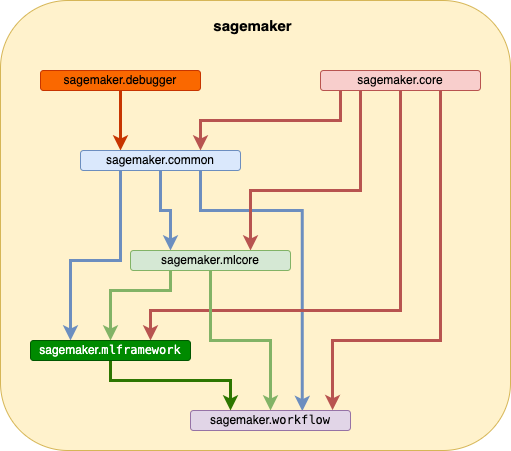

<!-- README.md is generated from README.Rmd. Please edit that file -->

# sagemaker

<!-- badges: start -->
<!-- badges: end -->

The goal of sagemaker is to …

## Installation

You can install the development version of sagemaker from
[GitHub](https://github.com/) with:

``` r
# install.packages("remotes)
remotes::install_github("DyfanJones/sagemaker-r-sdk")
```

# Warning!!!

This repo is in constantly under development and is not currently
stable. sagemaker is currently aligning it’s api with sagemaker v2,
apologises for any code breaking this causes.

# Brief overview:

The idea is to rebuild [AWS Sagemaker Python
SDK](https://github.com/aws/sagemaker-python-sdk) using
[R6](https://github.com/r-lib/R6) classes and
[paws](https://github.com/paws-r/paws) behind the scenes.

# API overview:

This package aims to mimic python’s AWS Sagemaker SDK api, but using
`R6` and `paws`

# Architecture Design:



`sagemaker` is a metadata package that contains all methods to interact
with Amazon Sagemaker.

-   [sagemaker.core](https://github.com/DyfanJones/sagemaker-r-local):
    Containse core components of sdk for example `Session` R6 class
-   [sagemaker.common](https://github.com/DyfanJones/sagemaker-r-common):
    Contains common components used throughout sagemaker sdk
-   [sagemaker.mlcore](https://github.com/DyfanJones/sagemaker-r-mlcore):
    Contains core components for machine learning (ML) and amazon
    developed ML.
-   [sagemaker.mlframework](https://github.com/DyfanJones/sagemaker-r-mlframework):
    Contains ML frameworks developed for Amazon Sagemaker i.e. `SKLearn`
-   [sagemaker.workflow](https://github.com/DyfanJones/sagemaker-r-workflow):
    Contains sagemaker pipeline and workflows
-   [sagemaker.debugger](https://github.com/DyfanJones/sagemaker-r-debugger):
    Contains debugging methods
    (<https://github.com/awslabs/sagemaker-debugger-rulesconfig>)

# Learn from examples:

## Amazon Algorithms:

`sagemaker` is designed to minic python’s sagemaker sdk. Therefore all
examples for python’s sagemaker should be able to accessible.

### Examples:

-   [Targeted Direct
    Marketing](https://github.com/DyfanJones/sagemaker-r-sdk/tree/master/examples/introduction_to_applying_machine_learning/xgboost_direct_marketing)
    predicts potential customers that are most likely to convert based
    on customer and aggregate level metrics, using Amazon SageMaker’s
    implementation of XGBoost.
-   [XGBoost
    Tuning](https://github.com/DyfanJones/sagemaker-r-sdk/blob/master/examples/hyparameter_tuning/xgboost_direct_maketing)
    shows how to use SageMaker hyperparameter tuning to improve your
    model fits for the [Targeted Direct
    Marketing](https://github.com/DyfanJones/sagemaker-r-sdk/tree/master/examples/introduction_to_applying_machine_learning/xgboost_direct_marketing)
    task.
-   [BlazingText
    Word2Vec](https://github.com/DyfanJones/sagemaker-r-sdk/tree/master/examples/introduction_to_amazon_algorithms/blazingtext_word2vec_text8)
    generates Word2Vec embeddings from a cleaned text dump of Wikipedia
    articles using SageMaker’s fast and scalable BlazingText
    implementation.

### R Model Examples:

-   [R Multivariate Adaptive Regression
    Splines](https://github.com/DyfanJones/sagemaker-r-sdk/tree/master/examples/hyparameter_tuning/r_bring_your_own/mars-restrserve)
    example over iris data.frame

**Note: If a feature hasn’t yet been implemented please feel free to
raise a pull request or a ticket**

## For developers

To keep the package within the CRAN size limit of 5MB. sagemaker is
currently using a separate repository
([sagemaker-r-test-data](https://github.com/DyfanJones/sagemaker-r-test-data))
to store R variants of test data stored in
[sagemaker-python-sdk](https://github.com/aws/sagemaker-python-sdk).
sagemaker-r-test-data will only consist of data that can’t be read into
R natively i.e. python pickle files. For other test data sagemaker will
read it directly from sagemaker-python-sdk.
